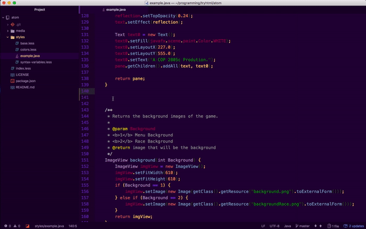

> TryHTML UI theme for [Atom](https://atom.io). Let's code in Indigo.

# Installation

Using  **Atom**  :

>Themes can be installed and changed from the **`Settings View`** which you can open by selecting

1. `Atom` → `Preferences` menu, and clicking the 
1. `Install` tab and select the 
1. `Themes` button on the left hand navigation. 
1. Search for `tryhtml-atom-ui` on UI Theme

> Using Terminal

`$ apm install tryhtml-atom-ui`

# Social

>
>
>

# Donate

# Related

- [TryHTML Atom Syntax](https://github.com/tryhtml/atom-syntax) Theme.

# Contributors

 |
--- |
[Carlos Abraham](https://github.com/19cah) |

# License

The **tryHTML** UI theme for [Atom](https://atom.io) is licensed under [MIT license](LICENSE).
